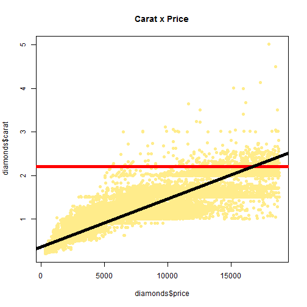
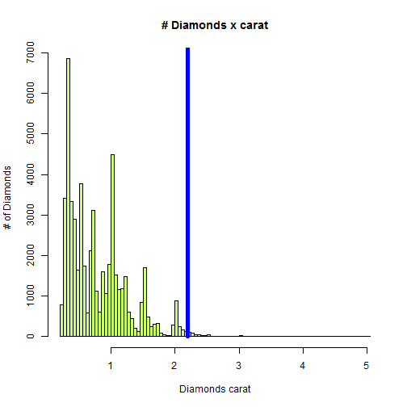

Diamonds data analysis
========================================================

author: David Cano
date: Tue Aug 18 14:29:19 2015


Created for the Coursera Project within the Data Scientist Specialization

Introduction
========================================================

This presentation will help you understand the motivation behind the data analysis project on diamonds analysis (that can be access from **https://davidcanoriesgo.shinyapps.io/DataProducts**).

- Data used is "Diamonds", included within the ggplot2 package
- shinyapps.io web product was created for the purpose of the analysis
- A description of the product is included within the product itself (linked above)

What data is being used?
========================================================

First of all, let's summarize data included: `diamonds`


```r
library(ggplot2)
data(diamonds)
str(diamonds)
```
<small><small><small>

```
'data.frame':	53940 obs. of  10 variables:
 $ carat  : num  0.23 0.21 0.23 0.29 0.31 0.24 0.24 0.26 0.22 0.23 ...
 $ cut    : Ord.factor w/ 5 levels "Fair"<"Good"<..: 5 4 2 4 2 3 3 3 1 3 ...
 $ color  : Ord.factor w/ 7 levels "D"<"E"<"F"<"G"<..: 2 2 2 6 7 7 6 5 2 5 ...
 $ clarity: Ord.factor w/ 8 levels "I1"<"SI2"<"SI1"<..: 2 3 5 4 2 6 7 3 4 5 ...
 $ depth  : num  61.5 59.8 56.9 62.4 63.3 62.8 62.3 61.9 65.1 59.4 ...
 $ table  : num  55 61 65 58 58 57 57 55 61 61 ...
 $ price  : int  326 326 327 334 335 336 336 337 337 338 ...
 $ x      : num  3.95 3.89 4.05 4.2 4.34 3.94 3.95 4.07 3.87 4 ...
 $ y      : num  3.98 3.84 4.07 4.23 4.35 3.96 3.98 4.11 3.78 4.05 ...
 $ z      : num  2.43 2.31 2.31 2.63 2.75 2.48 2.47 2.53 2.49 2.39 ...
```
</small></small></small>

Data Content
========================================================


<small><small>
- [, 1]  carat: weight of diamond stones in carat unit
- [, 2]	 cut: diamond's quality
- [, 3]	 color: a factor with levels (D,E,F,G,H,I)
- [, 4]	 clarity: a factor with levels (IF,VVS1,VVS2,VS1,VS2)
- [, 5]	 depth: percentage ratio diameter / depth (dimension)

</small></small>

***

<small><small>
- [, 6]	 table: percentage ratio total width / width table
- [, 7]	 price: in USD
- [, 8]	 x: dimension 1
- [, 9]	 y: dimension 2
- [,10]	 z: dimension 3

</small></small>

What to expect ... when you select a carat
========================================================


 
 
 ***     
      
 

